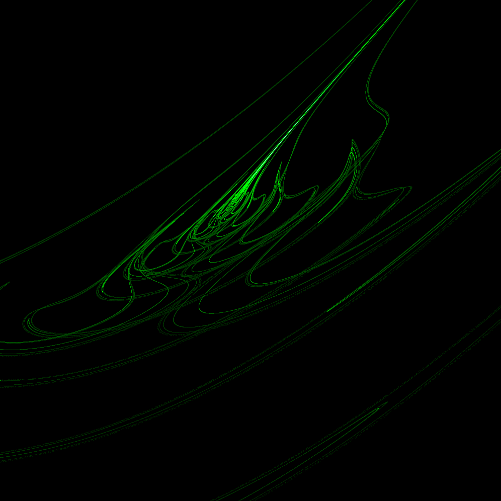
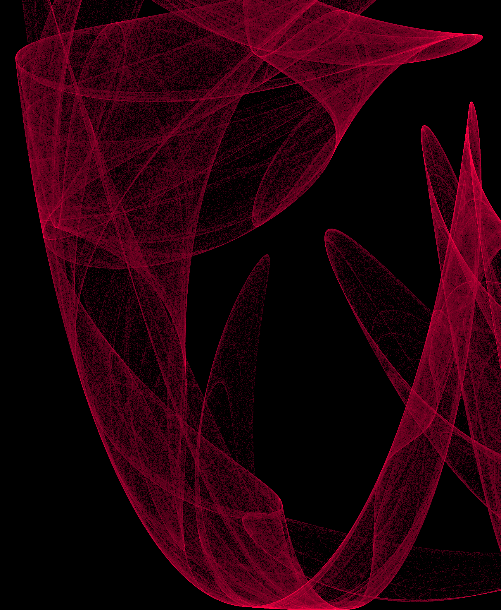
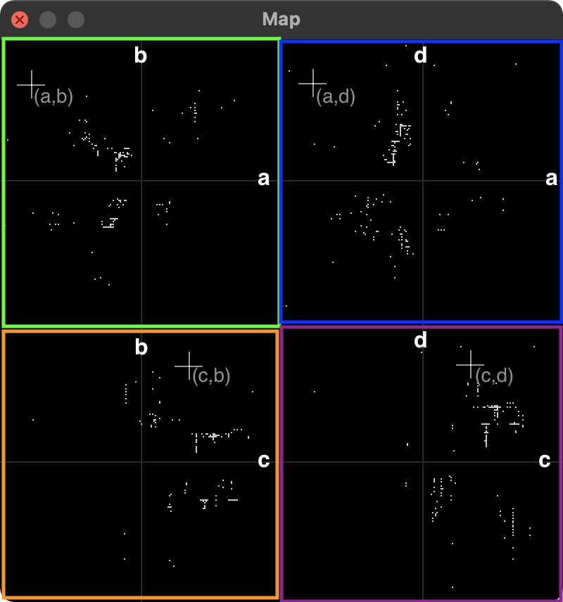

# Attractors
A [Rust](https://www.rust-lang.org/) project to generate and explore [strange
attractors](https://en.wikipedia.org/wiki/Attractor#Strange_attractor) visually
and easily. The emphasis is on using strange attractors as an artistic medium,
and not explicitly on the maths behind them (although the maths is
unavoidable).

See below for example images of strange attractors to give you a feel for what
they look like. After that is some info about getting started with the project
and running the code to find your own. Following that is some more background
info about strange attractors and the different types.

## Examples of strange attractors
See more images in the [`imgs`](https://github.com/beyarkay/attractors/tree/main/img)
directory. They're all very high resolution (about 7000 pixels on each side) so
you can print them out at An size at 300 DPI.




## Get started and making your own strange attractors

Install the rust compiler and cargo by following the instructions at [install
rust](https://www.rust-lang.org/tools/install) or by running the command: 
```sh
curl --proto '=https' --tlsv1.2 -sSf https://sh.rustup.rs | sh
```

Then clone this project: 

```sh
git clone https://github.com/beyarkay/attractors.git
```

Change directory and run the project in `--release` mode:
```sh
cd attractors && cargo run --release
```
The extra optimisations given by the `--release` flag are _really_ required for
a smooth experience.

There will be some console output explaining the available commands and what
they do, and two windows should pop up: a small diagnostics window (which you
can ignore) a square Map window (which you can ignore), and a larger square
window.

Click on the large square window to focus it. The attractor will automatically
be drawn, and you can change the 4 parameters fed to the attractor (named a, b,
c, d) with vim-like key bindings:
```
j -> decrease a; k -> increase a; 
J -> decrease b; K -> increase b;
h -> decrease c; l -> increase c; 
H -> decrease d; L -> increase d;
```

### The Map window

If you look at the Map window, you'll see four 2D plots. Each of the four plots
shows two parameters, and together they can guide you around the 4D parameter
space. The plots are: a-b, a-d, c-b, and c-d. They're oriented like this:
```
       b            d     
       |            |     
  -----+----a  -----+----a
       |            |     
       |            |     

       b            d     
       |            |     
  -----+----c  -----+----c
       |            |     
       |            |     
```

And the window looks like this:



As you press `hjklHJKL` the 4 cross-hairs on the Map window will move around
the four plots so the cross-hair on the `a-b` plot will show the current values
for the `a` and `b` parameters, the cross-hair on the `a-d` plot will show the
current values for the `a` and `d` parameters, and so on.

There are also lots of white dots on the map, like constellations. Each dot
represents a special or interesting strange attractor, and you can mark a particular
attractor as special by pressing the `m` key. Special attractors are saved to
`cache/clifford/special.txt` and will persist between runs of the program. Try
navigate to different special attractors. It's takes getting used to, since all
four cross-hairs need to line up different white dots but it's a fun exercise.

### Other commands

Additionally, you can select a random set of parameters by pressing R:
```
`[R]` => Randomize the Clifford parameters and re-run the attractor with these new parameters
```

You can `print` off an attractor by pressing `p` which will save it as a `.png`
in `cached/clifford/`.
```
`[P]` => Save the attractor in high resolution to disc as png (enabled: true)
```

You can also change the hue of the attractor by pressing `e` or `E`:
```
`[E]` => Increase or decrease the LCH hue intercept by 0.01 (enabled: true)
```

Pressing `n` or `N` will increase/decrease the decay factor between 0 and 1.
Values closer to zero will cause previous attractors to blend into future
attractors like echoes, which is a nice effect but primarily is good at reducing
the strobing and stuttering effect dangerous to those with photosensitive epilepsy.
```
`[N]` =>  Change how quickly one attractor merges to another (helps with photosensitive epilepsy)
```


## What are Strange Attractors
Strange attractors are (usually) a recursive formula which take in a point in
2D or 3D space and (using a set of parameters) return a different point in that
space. An example equation might be:
```
x_new = sin(a * y_old) + c * cos(a * x_old)
y_new = sin(b * x_old) + d * cos(b * y_old)
```

That new point is then sent back into the same recursive formula to generate
another point. And another, and another, etc. Those points are then coerced
into a pixel grid, and the resulting 2D or 3D histogram sometimes looks
spectacular.

See these links for examples of strange attractors.

- [Clifford Attractors](http://paulbourke.net/fractals/clifford/)
- [De Jong Attractors](http://paulbourke.net/fractals/peterdejong/)
- [Lyapunov Exponent Attractors](http://paulbourke.net/fractals/lyapunov/)
- [Sprott Polynomial Attractors](http://paulbourke.net/fractals/sprott/)
- [Juan Attractors](http://paulbourke.net/fractals/juan2/)
- [Den Tsucs Attractors](http://paulbourke.net/fractals/tsucs/)
- [Sánchez 'Bad Hairday' Attractors](http://paulbourke.net/fractals/2dmap/), also see
[here](https://www.r-bloggers.com/2019/10/strange-attractors-an-r-experiment-about-maths-recursivity-and-creative-coding/)
- [Arneodo Attractors](http://paulbourke.net/fractals/arneodo/)
- [Catrián Attractors](http://paulbourke.net/fractals/JuanCatrian/)
- [Burke-Shaw Attractors](http://paulbourke.net/fractals/burkeshaw/)
- [Yu-Wang Attractors](http://paulbourke.net/fractals/yuwang/)
- [Tinkerbell Attractor](https://en.wikipedia.org/wiki/Tinkerbell_map)
- [The King's Dream Attractors](https://nathanselikoff.com/training/tutorial-strange-attractors-in-c-and-opengl)
    - ```float xnew = sin(y*b) + c*sin(x*b); float ynew = sin(x*a) + d*sin(y*a);```
- [Others defined on wikipedia/chaotic_maps](https://en.wikipedia.org/wiki/List_of_chaotic_maps)
- [Others defined on Chaoscope](http://www.chaoscope.org/doc/attractors.htm)


## TODO
- Add Diagnostics: fractal dimension greater than 1.5 => Chaotic?
- Add Diagnostics: positive Lyapunov exponent => Chaotic
